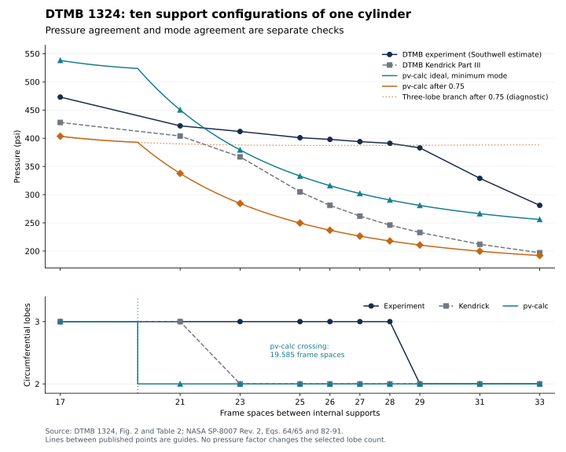

# Investigation of the ring-stiffened cylinder discrepancy

20 September 2026. Production equations, pressure factors, and mode limits
are unchanged; ring model 4.1.0 adds mode-domain and boundary reporting.
The [follow-up](sources/ring_boundary_and_nasa_evidence.md) adds the Table 1
closure comparison, traces NASA's four experimental citations, records the
DAPS intermediate-restraint probes, and identifies the excluded axisymmetric
(`n=0`) branch.

## Finding

The implementation reproduces the selected NASA equations, but the DTMB
comparison does **not** establish accurate prediction of housing collapse.
Three effects were being combined: an approximate elastic theory, NASA's
0.75 adjustment, and experimental supports different from the ideal model.
There is also a real disagreement in the predicted buckling mode. Being below
these particular experimental values is insufficient to resolve those issues.

The investigation found no arithmetic, unit, ring-section, pressure-factor,
or mode-search error explaining the discrepancies. It did find a misleading
description of the experimental evidence and a useful asymptotic inconsistency
between the two NASA formulations. The independent DAPS4 comparison supports
investigating restraint and theory choice; it does not justify calibrating a
factor or adopting DAPS4 as a replacement capacity method.

## What the experimental column actually represents

[DTMB Report 1324](https://dome.mit.edu/handle/1721.3/48982), printed pp. 7–10,
identifies Table 2 as **one cylinder, 4-A, with ten movable internal-bulkhead
spacings**. Buckling pressures were estimated nondestructively using Southwell
extrapolation of strain measurements. They are not ten independent destructive
collapse tests. The measured circumferential deformation patterns remain
valuable evidence, but the rows share specimen geometry and measurement history.

The disks contacted the shell beneath stiffeners, with rounded contact edges
and wooden spacers. The shell continued beyond the internal supports. This
does not establish freely rotating boundaries for an isolated cylinder span.
The report explicitly investigated end restraint; its separate Table 1 shows
how strongly end-closure changes can affect the same specimen:

| Specimen | Case I pressure, psi | Case V pressure, psi | Increase |
|---|---:|---:|---:|
| 6 | 504 | 700 | 38.9% |
| 2-A | 339 | 409 | 20.6% |
| 3-A | 229 | 378 | 65.1% |
| 4-A | 178 | 289 | 62.4% |

These are observed differences between closure configurations, **not correction
factors for Table 2**. Table 1's Case I values are much closer to its own
simply-supported Kendrick predictions: 499, 317, 216, and 180 psi respectively.
The shortened end bays and closure geometry must be mapped separately before
adding these specimens to the public benchmark; Table 2's `N × 1.152 in`
length rule cannot simply be reused.
The follow-up now evaluates reconstructed lengths and their sensitivity;
an exact primary-source span reconstruction remains unresolved.

## Separate ideal theory from the NASA adjustment

All pressures below are psi; parentheses give circumferential lobes. The
NASA calculation has one axial half-wave in every row. Percentages use the
unadjusted NASA result and the indicated published reference.

| Frame spaces | Kendrick | Southwell estimate | pv-calc ideal | pv-calc × 0.75 | Ideal vs Kendrick | Ideal vs estimate |
|---:|---:|---:|---:|---:|---:|---:|
| 17 | 428 (3) | 473 (3) | 538.0 | 403.5 (3) | +25.7% | +13.8% |
| 21 | 404 (3) | 422 (3) | 450.2 | 337.7 (2) | +11.4% | +6.7% |
| 23 | 367 (2) | 412 (3) | 379.3 | 284.4 (2) | +3.3% | −7.9% |
| 25 | 305 (2) | 401 (3) | 332.9 | 249.7 (2) | +9.2% | −17.0% |
| 26 | 281 (2) | 398 (3) | 316.0 | 237.0 (2) | +12.4% | −20.6% |
| 27 | 262 (2) | 394 (3) | 302.0 | 226.5 (2) | +15.3% | −23.4% |
| 28 | 246 (2) | 391 (3) | 290.5 | 217.9 (2) | +18.1% | −25.7% |
| 29 | 233 (2) | 383 (2) | 280.9 | 210.7 (2) | +20.6% | −26.7% |
| 31 | 212 (2) | 329 (2) | 266.3 | 199.7 (2) | +25.6% | −19.1% |
| 33 | 197 (2) | 281 (2) | 256.0 | 192.0 (2) | +30.0% | −8.9% |

Thus the ideal NASA theory is **3.3–30.0% above Kendrick**, whereas the
adjusted result is 2.5–22.5% below it. The reported 14.7–45.0% deficit against
experiment includes the 25% adjustment. Removing that factor does not solve
the discrepancy: ideal pressures still range from 13.8% above to 26.7% below
the experimental estimates, with the same incorrect transition location.

The 0.75 is explicitly recommended for this pressure equation on printed p. 38
of [NASA SP-8007 Rev. 2](https://ntrs.nasa.gov/api/citations/20205011530/downloads/20205011530%20Rev%202FINALa%201-2023.pdf).
It is applied once. This investigation supplies no basis to remove or tune it.
NASA also says that Kendrick's approach is more accurate and predicts lower
pressures. The numerical ordering here is consistent with that statement.

## The mode transition is a separate problem



The calculated two-/three-lobe crossing is at **19.584812 frame spaces**,
not exactly at the first sampled two-lobe case, 21. Kendrick changes between
21 and 23; the measured pattern changes between 28 and 29. Multiplying every
mode by the same factor cannot change which mode is lowest.

For example, at 28 spaces, the adjusted two-lobe pressure is 217.9 psi,
while the adjusted three-lobe branch is 387.4 psi, close to the 391 psi
three-lobe estimate. That identifies where the discrepancy arises; the lower
eigenmode still governs the calculation. At 29 spaces the experiment
is already two-lobed; a similar pressure on the three-lobe branch would be
agreement with the wrong deformation pattern.

The report itself suggested an effective-length interpretation of restraint,
but explicitly said that evidence was insufficient to establish it. Fitting
an effective length to this curve would conflate support stiffness, theory
error, and specimen-specific effects.

## Equation and numerical audit

The [diagnostic runner](ring_shell_investigation.py) and its
[results](results/ring_shell_investigation.json) retain the following checks:

| Check | Result and implication |
|---|---|
| Drawing and units | Fig. 2 confirms 8.118 in ID, 0.035 in wall, 1.152 in pitch, and an external 0.086 × 0.169 in rectangle. The equation radius is 4.0765 in, at the shell mid-surface. |
| Section mapping | Physical centroid, area, centroidal bending inertia, eccentric coupling, and rectangular Saint-Venant torsion are consistent with the source mapping. |
| Source transcription | NASA Eqs. 64/65 and 82–91 match the implementation, including the hydrostatic axial-load term. |
| Search completeness | Independent exhaustive scans over `m=1..128, n=2..64` reproduce all ten production minima and verify the mode crossing. |
| Numerical cancellation | A 50-digit Schur-complement evaluation agrees with the determinant calculation within approximately `1.1e-13` relative for the ten governing modes. Inputs begin at the same double precision; this isolates elimination error. |
| Ring torsion | Including it changes the ten pressures by only 0.16–0.28%. It cannot explain the discrepancy. |
| Radius convention | Substituting inside or outside radius changes checked cases by no more than about 1.12%; neither is the source-prescribed choice. |
| Small dimensional perturbations | A ±1% ring-height change produces at most about 2.27% pressure change in the checked cases. |
| Length sensitivity | A one-bay change is appreciable near the crossing, but the source confirms the Table 2 supported-length mapping. Changing it to improve agreement would be calibration. |

Kendrick Part III provides a physical reason to expect a theory difference:
it refines deformation between frames and the shell width participating with
the frame. Its introduction explains why this reduces pressures relative to
the simpler whole-length sinusoidal treatment. The current NASA calculation
smears the stiffener stiffness and lacks that separate bay-scale deformation.
Kendrick Part III still uses a mean prebuckling hoop stress; attributing its
improvement to a fully resolved nonuniform prestress would be inaccurate.

NASA's often-repeated **10–40% low-lobe warning is in the axial-compression
discussion** on printed p. 35, concerning the shared formulation. It is a
qualitative caution rather than a hydrostatic-pressure accuracy interval,
and the runtime notes no longer quote it.

### A revealing long-cylinder limit

Let `D_eff = D_y − C_y²/E_y`, using the circumferential bending, coupling,
and extensional stiffnesses in the implementation. Condensing the in-plane
displacements from NASA's matrix as `mπ/L → 0` gives:

```text
Eq. 64: p(n) → n² D_eff / r³
minimum at n = 2: p64 → 4 D_eff / r³
Eq. 66:                p66 = 3 D_eff / r³
therefore:          0.75 p64 → p66
```

For this section, the limits are 235.2305 psi for ideal Eq. 64 and
176.4229 psi for ideal Eq. 66. The adjusted Eq. 64 limit equals the latter.
This follows algebraically and was also checked with high-precision evaluation
at a very large length. So the adjustment cancels a model-form difference at
the long-cylinder limit, and a small adjusted discrepancy there does not
imply a small theory error. NACA TN 4237, printed p. 6, discusses this 4/3
Donnell limit and its replacement by the ring solution.

This is an asymptotic diagnostic, not a finite-length selection rule. Neither
NASA edition supplies the required numerical Eq. 64/Eq. 66 transition, as
recorded in the [existing source investigation](sources/nasa_sp8007_eq64_eq66_transition.md).
Selecting Eq. 66 whenever `n=2`, or taking the minimum of both everywhere,
would introduce an unsupported rule.

## Independent DAPS4 comparison, actually executed

The public [DAPS4e.6 release](https://sourceforge.net/projects/daps4/files/)
contains Fortran source, derivations, and archived DTMB inputs/outputs. Its
eight GFortran source files were compiled, and all eight archived
simply-supported and eight clamped **global elastic** results were reproduced
at their printed precision before new cases were run. The executable
identifies itself as `Revision E.3.6, March 2026` inside the e.6 bundle.

Fresh inputs use the same physical Table 2 dimensions as pv-calc, unit design
factors, the elastic option, external rings, and either simply supported or
clamped ends. Every global result was unchanged when the reference pressure
was changed from 1 to 500 psi. The following are unadjusted elastic pressures:

| Frame spaces | DAPS4 simply supported, psi (n) | Southwell estimate, psi (n) | DAPS4 clamped, psi (n) |
|---:|---:|---:|---:|
| 17 | 408.9 (3) | 473 (3) | 640.7 (3) |
| 21 | 386.2 (3) | 422 (3) | 545.6 (3) |
| 23 | 331.3 (2) | 412 (3) | 518.1 (3) |
| 25 | 274.6 (2) | 401 (3) | 497.8 (3) |
| 26 | 253.6 (2) | 398 (3) | 489.6 (3) |
| 27 | 236.1 (2) | 394 (3) | 482.4 (3) |
| 28 | 221.7 (2) | 391 (3) | 476.1 (3) |
| 29 | 209.6 (2) | 383 (2) | 470.5 (3) |
| 31 | 190.8 (2) | 329 (2) | 461.1 (3) |
| 33 | 177.4 (2) | 281 (2) | 453.5 (3) |

The simply-supported DAPS4 transition falls in the same sampled interval as
Kendrick's, but its pressures are 4.4–10.0% lower than Kendrick's. DAPS4 uses
a different formulation and conventions; this is not exact Kendrick parity.
Its richer deformation treatment still leaves a large deficit against the
internal-bulkhead experiments. Changing the support assumption raises both
pressure and the persistence of the three-lobe mode substantially.

**Inference:** these calculations, together with DTMB's own closure tests,
make restraint mismatch a strong explanation for a substantial part of the
experiment discrepancy. The two DAPS4 curves numerically bracket every Table 2
estimate, but are not rigorous bounds on the actual fixtures. Fully clamped
ends also predict the wrong mode for the longest tests. Independent fixture
stiffness is needed before assigning a percentage of the error to restraint.

The [runner](daps4_ring_crosscheck.py) and
[retained evidence](results/daps4_ring_crosscheck.json) pin source and fixture
hashes, compiler options, inputs, output hashes, modes, and reference-load
checks. Only general instability was audited. In particular, the separate
ring-frame-instability output changed with reference pressure in these runs;
it is excluded. Some executions report underflow/denormal flags; stderr is
retained alongside successful termination and archived-result reproduction.
The intermediate-restraint probes do not reproduce all archived results;
their failures and forced-boundary warnings are retained in the same JSON
and discussed in the follow-up.

## Additional validation worth doing

The next cases should distinguish theory, boundary conditions, and failure
mechanisms. Adding more points from the same Table 2 curve supplies little
independent coverage.

| Priority and evidence | What it would test | What must be resolved first |
|---|---|---|
| **1. DTMB 1324 Table 1, Case I:** specimens 6, 2-A, 3-A, and 4-A | Reconstructed-span comparisons are now in the [follow-up](sources/ring_boundary_and_nasa_evidence.md), with all four Case I lobe counts matched. | Reconcile exact spans and shortened end bays with the primary source; map closure flexibility. |
| **2. Qualified pressure FEA, then discrete-ring elastic cases** | The two-/three-lobe transition, curvature approximation, smeared versus discrete rings, and prescribed rotational restraint. | First reproduce an analytic/published pressure-loaded ring benchmark with the complete pressure tangent, then a smooth-shell pressure benchmark. The currently saved CalculiX results do not qualify. |
| **3. Cho et al. (2018), welded flat-bar ring cylinders** | Independent practical housing-like geometries, internal/external frames, imperfections, and different observed failure mechanisms. | Preserve measured geometry, end-bay spacing, shell/ring material differences, and imperfections. Separate elastic buckling from ultimate collapse and do not claim current global-only coverage of yielding or interaction. |
| **4. NASA TN D-3111 (Dow, 1965)** | Local buckling followed by postbuckling and general collapse; a useful challenge to treating local and global pressures independently. | These are 2024-T3 aluminum cylinders with Z-section rings and fabricated seams, beyond the supported solid rectangle. Separate the reported local onset and final collapse pressures. |
| **5. DTMB 1255 BR-7M** | Machined rectangular-ring shell yielding and prebuckling stress distribution. Useful for the missing strength path. | Implement and independently map the stress method first. This is not an elastic general-instability benchmark. See the [existing source assessment](sources/ring_failure_mode_selection.md). |

[Cho et al., *Experimental investigations on failure modes of ring-stiffened
cylinders under external hydrostatic pressure*](https://doi.org/10.1016/j.ijnaoe.2017.12.002)
reports nine welded steel models. Its RS9 overall-collapse case, RS4–7 local
cases, and RSI/RSII interaction cases offer useful distinct targets. The latter
include frame tripping.

[NASA TN D-3111](https://ntrs.nasa.gov/api/citations/19660001966/downloads/19660001966.pdf)
reports ten aluminum cylinders with local buckling preceding general collapse.
That sequence makes it useful for validating a future interaction treatment,
rather than comparing every reported final pressure to the current global
elastic formula.

DAPS4's comparison catalog also points to DTMB 1501, 1600, 1614, and 1992 for
additional interbay, material, and ring-size coverage; those reports have
not been transcribed here. The catalog itself warns that matching a pressure
while predicting the wrong failure mechanism is inadequate.

For a future release decision, prespecify pressure and mode acceptance limits,
use separate cases for choosing a method and assessing it, and vary shell
slenderness, pitch, ring area/depth, location, and restraint independently.
Keep elastic onset, adjusted recommendations, local buckling, yielding,
tripping, and ultimate collapse as separate comparison columns. A single
fitted pressure multiplier cannot validate those different outputs.

## Why the existing FEA does not settle this

The saved mesh-converged CalculiX `*BUCKLE` runs omit distributed-pressure load
stiffness. The [FEA README](fea/README.md) already documents that limitation.
The separately attempted prestressed-frequency procedure also failed its
pressure-ring qualification: its finest result was 19.184% below the published
reference despite a small final mesh change. See the
[qualification record](sources/cylinder_solver_qualification.md).

Consequently, apparent agreement of those cylinder eigenvalues with either
experiment or a theory cannot be used to choose the correct formulation.
The necessary next FEA work is procedure qualification, followed by explicit
support and discretization comparisons; simply refining the existing cylinder
mesh is insufficient.

## Reproduction and source provenance

Run from the repository root:

```console
uv run --with matplotlib python validation/ring_shell_investigation.py --output validation/results/ring_shell_investigation.json --plot validation/figures/ring_shell_dtmb_investigation.svg
uv run python validation/daps4_ring_crosscheck.py --release /path/to/DAPS4e.6 --work-directory /tmp/daps-crosscheck --output validation/results/daps4_ring_crosscheck.json
uv run pytest tests/test_independent_reference_parity.py tests/test_dtmb_1324_case17.py tests/test_ring_shell.py tests/test_ring_section.py
```

The first command checks production/reference agreement, the extended mode
search, high-precision evaluation, and the asymptotic identity. Plotting alone
requires matplotlib. The second requires an external unpacked release and
GFortran, verifies all eight source and four fixture hashes before execution,
and checks 16 archived outputs plus 20 new boundary cases and 20 load-scaling
repeats. The expanded audit also pins four additional fixture files and records
16 intermediate-restraint probes which do not fully reproduce. External source
and PDFs are not vendored or runtime dependencies.

Primary source pages were checked visually where equations, geometry, and
tabulated numbers were used. SHA-256 records identify the inspected PDFs:

| Source | Location used | SHA-256 |
|---|---|---|
| DTMB 1324 | Fig. 2; Tables 1–2; printed pp. 7–10 | `975aaf2ef7f4b0adde9cd15dd8dc5ea378e91e097d5f145d60923aeeede728a2` |
| NASA SP-8007 Rev. 2 | Printed pp. 35, 37–38, 40–42 | `299dfb8807862f174768356353f39c6bf6993596cb6f5933dd4fd23181e8837b` |
| Kendrick Part III | DAPS release `Documentation/Secondary/Kendrick, Part III.pdf`, introduction, PDF p. 8 | `273c6cba57674f59f4ce01bf027d8fce2d6ccea413133e3bd9eca471f29044e8` |
| Renzi IHTR 2944 | DAPS release `Documentation/Primary/Renzi, IHTR 2944.pdf`, general-instability derivation | `cf3c0c21e62fbb212eb320d9333b2aeb40f855ba47a584a0dcfadb7da71cd4b4` |
| Gordon, Comparisons of DAPS4 Predictions with Model Test Results | Same Primary directory; limitations and DTMB 1324 comparison | `0cc742239fa795cfabcd004cec70c159ab45b7d3d867b84066badbb4078de6d5` |
| Gordon, General Instability Analysis of Ring-Stiffened Cylinders with Specified End Constraints in DAPS4 | Same Primary directory; end-constraint comparisons | `7e5144198a169793a99afb9607a2ccd65b9fb575b0b18e371d443e59d035adf7` |
| NASA TN D-3111 | Test construction and local/final failure distinction | `33015b3393fb3927eb9a3f172e5b731419d6bd1fbe0e10568ff4f54cd8b26739` |

The complete numeric audit and external-source file hashes are in the two
JSON artifacts. The NASA transcription is verified; its agreement with these
tests and the coverage of a complete ring-stiffened housing remain open.
